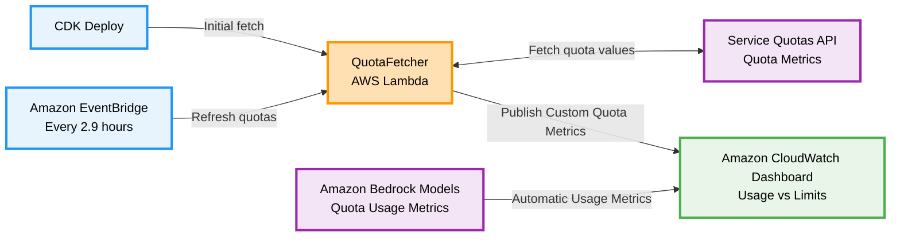

# TPM/RPM Quota Dashboard for Amazon Bedrock

A CDK stack that automatically creates an Amazon CloudWatch Dashboard to monitor Amazon Bedrock model token and request per minute quota usage against Service Quotas.

Deployment time: 5-10 minutes. Cost: ~$5.40/month.


## Why This Solution?

While Amazon Bedrock provides excellent CloudWatch metrics for monitoring model usage, calculating actual TPM (Tokens Per Minute) quota consumption requires manual computation. Amazon Bedrock TPM quota consumption follows this formula:

```
Total Tokens = InputTokens + CacheWriteTokens + (OutputTokens × BurndownRate)
```

For detailed information about TPM quota calculation and burndown rates, see the [AWS Bedrock TPM Quota Calculation documentation](https://docs.aws.amazon.com/bedrock/latest/userguide/quotas-token-burndown.html#quotas-token-burndown-management).

**The challenge:** Teams working with Bedrock quotas face:
- **Manual formula application** - Must apply the calculation manually for each model
- **Burndown rate research** - Different models have different rates (1x for most models, 5x for Claude 3.7/4 series)
- **No direct TPM Quota Usage metrics** - CloudWatch provides individual token metrics, but not the calculated TPM quota consumption

**This solution:** Eliminates manual computation by automatically applying model-specific burndown rates and formulas, giving you direct visibility into quota consumption across 80+ pre-configured models.

## Features

- **80+ Pre-configured Models**: Amazon Nova, Claude, Llama, Mistral, Titan, and more
- **Type-Safe Registry**: Compile-time validation and IDE autocomplete for model configurations
- **Region-Specific Architecture**: Easy deployment to different AWS regions with region-specific quota codes
- **Dual Quota Monitoring**: Tracks both token quotas (TPM) and request quotas (RPM)
- **Multi-Endpoint Support**: Regional, cross-region, and global-cross-region endpoints
- **Auto-Refresh**: Updates quota values every 2.9 hours via Amazon EventBridge
- **Visual Dashboard**: 2-column layout with red quota limit lines

## Prerequisites & Setup

**Requirements:**
- AWS CLI configured
- Node.js 18+ and npm
- AWS CDK CLI: `npm install -g aws-cdk`
- Permissions for Amazon CloudWatch, AWS Lambda, AWS IAM, Service Quotas, Amazon EventBridge

**Deploy:**

Navigate into the CDK-Quota-Dashboards repository, and then run the following commands.
```bash
npm install
AWS_DEFAULT_REGION=your-region npx cdk bootstrap  # First time only
npm run build
AWS_DEFAULT_REGION=your-region npx cdk deploy
```

**For different regions:** Update `lib/bedrock-registries.ts` to import the correct region file before deploying.

**⚠️ Important:** The registry import must match your deployment region, or you'll get incorrect quota codes. Note that us-east-1 is the most fully featured in this repo. You can always add more models by following [these instructions](lib/bedrock-registries/README.md) 
## Architecture

### System Overview

Serverless monitoring solution that tracks Amazon Bedrock model usage against Service Quotas via Amazon CloudWatch dashboards.

### Architecture Diagram



### Key Components

- **QuotaFetcher AWS Lambda**: ARM64-optimized function that fetches Service Quota values and publishes Amazon CloudWatch metrics
- **Amazon EventBridge Rule**: Refreshes quotas every 2.9 hours
- **Amazon CloudWatch Dashboard**: Displays usage vs limits with red quota lines
- **Type-Safe Registry System**: Region-specific model configurations with compile-time validation

### Registry Architecture

The solution uses a **region-specific, type-safe registry architecture**:

```
lib/bedrock-registries/
├── us-east-1.ts       # US East 1 quota codes (current)
├── us-west-2.ts       # US West 2 quota codes (when created)
└── eu-west-1.ts       # EU West 1 quota codes (when created)
```

**Benefits:**
- ✅ **Type Safety**: Compile-time validation prevents invalid endpoint access
- ✅ **IDE Autocomplete**: Full IntelliSense support for model properties
- ✅ **Region Clarity**: Explicit region selection with one-line deployment changes
- ✅ **Direct Access**: `BEDROCK_MODELS.AMAZON.NOVA_LITE_V1.regional.tokenQuotaCode`
- ✅ **Endpoint Validation**: TypeScript prevents access to unsupported endpoints

## Adding New Models

For detailed instructions on adding new models, configuring the registry, and understanding the type-safe model system, see the [Bedrock Registries README](lib/bedrock-registries/README.md).

## Customization & Commands

**Change refresh frequency** (default: 2.9 hours):
```typescript
schedule: events.Schedule.rate(cdk.Duration.hours(6))
```

**Useful commands:**
- `npm run build` - Compile TypeScript
- `npm run test` - Run Jest tests  
- `AWS_DEFAULT_REGION=your-region npx cdk deploy` - Deploy to AWS
- `AWS_DEFAULT_REGION=your-region npx cdk diff` - Compare with deployed stack
- `npx tsc --noEmit` - Check TypeScript compilation without output

## Security

**IAM Permissions (Least Privilege):**
- Service Quotas: Read-only, Amazon Bedrock service only
- Amazon CloudWatch: Write to `Bedrock/Quotas` namespace only
- No secrets stored, AWS IAM role-based auth only

**Data Protection:**
- HTTPS/TLS 1.2+ for all API calls
- Amazon CloudWatch encryption at rest
- Only non-sensitive quota/usage data processed

**Monitoring:**
- All API calls logged via AWS CloudTrail
- AWS Lambda execution logs in Amazon CloudWatch
- Rate limiting with exponential backoff

See [CONTRIBUTING](CONTRIBUTING.md#security-issue-notifications) for more information.

## Troubleshooting

**Quota fetch fails:**
- Check AWS IAM permissions for Service Quotas
- Verify quota codes for your region match the registry import
- Check QuotaFetcher AWS Lambda logs
- Ensure deployment region matches registry configuration

**No metrics showing:**
- Wait 1-2 minutes for metrics to populate
- Ensure you've invoked the models
- Verify model IDs match exactly (case-sensitive)
- Check model configuration in region-specific registry file

**No quota limit line:**
- Wait for next refresh (every 2.9 hours)
- Check `Bedrock/Quotas` namespace in Amazon CloudWatch
- Manually invoke QuotaFetcher AWS Lambda
- Verify quota codes exist in your deployment region

**TypeScript compilation errors:**
- Ensure you're using supported endpoint types for each model
- Check that quota codes follow the `L-xxxxxxxx` format
- Verify all required model properties are present
- Run `npx tsc --noEmit` to check for type errors

**Region mismatch errors:**
- Ensure `lib/bedrock-registries.ts` imports the correct region file
- Verify deployment region matches the imported registry
- Check that quota codes exist in your target region

## Outputs

After deployment, the stack outputs:
- **DashboardURL**: Direct link to Amazon CloudWatch dashboard
- **DashboardName**: Name of the created dashboard

## Cost Considerations

**Monthly costs (~$5.40):**
- Amazon CloudWatch Dashboard: $3.00
- Custom Metrics (8 metrics): $2.40 
- AWS Lambda + Amazon EventBridge: ~$0.03

**Detailed breakdown:**
- 4 active models × 2 metrics per model (TokenQuota + RequestQuota) = 8 custom metrics
- 8 metrics × $0.30/metric/month = $2.40/month
- **Cost scales directly with number of monitored models:** Each additional model adds $0.60/month (2 metrics × $0.30)

**Important notes:**
- Custom metrics persist 15 months after deletion
- When you run `npx cdk destroy`, all resources stop immediately except Amazon CloudWatch custom metrics, which persist for 15 months and incur minimal charges until expiration
- To eliminate all costs, you can manually delete metrics from the "Bedrock/Quotas" namespace in the Amazon CloudWatch console

## Cleanup

To remove all deployed resources and stop incurring charges:

### Steps

1. Run the destroy command:

```bash
AWS_DEFAULT_REGION=your-region npx cdk destroy
```

2. Confirm deletion when prompted

3. Verify cleanup in AWS Console:
   - Amazon CloudWatch Dashboard: Confirm "BedrockQuotaConsumptionByModel" is deleted
   - AWS Lambda: Confirm QuotaFetcher function is removed
   - Amazon EventBridge: Confirm DailyQuotaRefresh rule is deleted
   - Amazon CloudWatch Metrics: Custom metrics in "Bedrock/Quotas" namespace will expire after 15 months

**Note:** Local registry files (`lib/bedrock-registries/`) are not affected by CDK destroy and remain for future deployments.

**Warning:** This action is irreversible.

**Estimated cleanup time:** 2-3 minutes

**Post-cleanup costs:** Amazon CloudWatch custom metrics may incur minimal charges ($0.30/metric) until they expire after 15 months of inactivity.

## License

This library is licensed under the MIT-0 License. See the LICENSE file.

