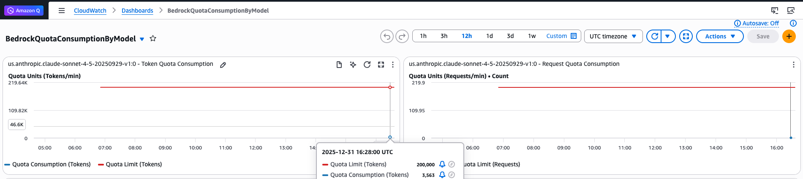
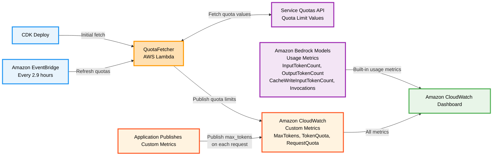

# TPM/RPM Quota Dashboard for Amazon Bedrock

A CDK stack that automatically creates an Amazon CloudWatch Dashboard to monitor Amazon Bedrock model token and request per minute quota usage against Service Quotas.

Deployment time: 5-10 minutes. Cost: ~$5.73/month.



## Why This Sample?

While Amazon Bedrock provides excellent CloudWatch metrics for monitoring model usage, calculating actual TPM (Tokens Per Minute) quota consumption requires understanding token calculations and burndown rates. Amazon Bedrock uses a token counting system with different calculation stages.

### Token Calculation Stages

Amazon Bedrock calculates token quota consumption in three stages:

1. **At Request Start** - Reserves quota based on:
   ```
   Total Input Tokens + max_tokens
   ```

2. **During Processing** - Periodically adjusts quota based on actual output generation

3. **At Request End** - Final calculation using:
   ```
   InputTokenCount + CacheWriteInputTokens + (OutputTokenCount × BurndownRate)
   ```
For detailed information about the complete token quota calculation system, see the [official AWS documentation on Bedrock token quota management](https://docs.aws.amazon.com/bedrock/latest/userguide/quotas-token-burndown.html).

### Why Throttling Occurs

The most common cause of unexpected throttling is the **quota reservation at request start**. Even if actual token usage is low, Bedrock reserves quota based on the `max_tokens` parameter, which can be dramatically larger than actual output.

If `max_tokens` is not explicitly set, it defaults to the model's maximum output capacity. For Claude Sonnet, this is 64,000 tokens. This default behavior is the source of most unexpected throttling issues.

**Example with Claude Sonnet (64K max_tokens default):**
- Request: 1,000 input tokens, `max_tokens: 64,000` (default if not set)
- **Reserved at start**: 65,000 tokens (1,000 + 64,000)
- **Actual output**: 100 tokens
- **Final consumption**: Calculated using model's burndown rate
- **Difference**: 63,900 tokens were temporarily held but not consumed

This massive gap between reserved and actual consumption explains why applications experience throttling even when actual token usage appears low. Without tracking the `max_tokens` parameter, it is difficult to understand the quota reservation.

### Custom Metrics for Request Start Tracking

To accurately track quota consumption at request start (which causes throttling), publish one custom metric: the `max_tokens` parameter value.

Here are implementation examples:

#### Boto3 Client Wrapper with max_tokens Tracking

```python
import boto3
import json
import logging
from typing import Any, Dict

# Configure logging
logging.basicConfig(level=logging.INFO, format='%(message)s')
logger = logging.getLogger(__name__)

class BedrockClientWithMetrics:
    """
    Boto3 client wrapper that publishes max_tokens metrics
    while preserving all original Bedrock client functionality.
    """
    
    def __init__(self, bedrock_client=None, cloudwatch_client=None):
        self.bedrock_client = bedrock_client or boto3.client('bedrock-runtime')
        self.cloudwatch_client = cloudwatch_client or boto3.client('cloudwatch')
    
    def converse(self, **kwargs) -> Dict[str, Any]:
        """
        Enhanced converse that publishes max_tokens metrics before API calls.
        Preserves all original functionality and return values.
        """
        model_id = kwargs.get('modelId')
        inference_config = kwargs.get('inferenceConfig', {})
        
        # Extract max_tokens from inference config if present
        if inference_config and model_id:
            max_tokens = inference_config.get('maxTokens')
            if max_tokens is not None:
                self._publish_max_tokens_metric(model_id, max_tokens)
        
        # Call original converse with all parameters
        return self.bedrock_client.converse(**kwargs)
    
    def _publish_max_tokens_metric(self, model_id: str, max_tokens: int):
        """Publish max_tokens value to CloudWatch custom metrics."""
        logger.info(f"Publishing metric: ModelId={model_id}, MaxTokens={max_tokens}")
        try:
            self.cloudwatch_client.put_metric_data(
                Namespace='Bedrock/Quotas',
                MetricData=[
                    {
                        'MetricName': 'MaxTokens',
                        'Dimensions': [
                            {
                                'Name': 'ModelId',
                                'Value': model_id
                            }
                        ],
                        'Value': max_tokens,
                        'Unit': 'None'
                    }
                ]
            )
            logger.info("Metric published successfully!")
        except Exception as e:
            # Log error but don't fail the Bedrock API call
            logger.error(f"Failed to publish max_tokens metric: {e}")
    
    def __getattr__(self, name):
        """Delegate all other method calls to the original client."""
        return getattr(self.bedrock_client, name)

# Usage example:
if __name__ == "__main__":
    logger.info("Running Boto3 BedrockClientWithMetrics example...")

    bedrock_client = BedrockClientWithMetrics()
    
    # Use the Converse API with proper format
    messages = [{"role": "user", "content": [{"text": "Hello, what is your name?"}]}]
    
    response = bedrock_client.converse(
        modelId='us.anthropic.claude-haiku-4-5-20251001-v1:0',
        messages=messages,
        inferenceConfig={
            'maxTokens': 4096,  # This will be automatically published as a custom metric
            'temperature': 0.7
        }
    )
    
    logger.info("Model invocation successful!")
    logger.info("Response: %s", response['output']['message']['content'][0]['text'])
```

#### [Strands Agent](https://strandsagents.com/latest/) Integration

```python
import boto3
import logging
from strands import Agent
from strands.models.bedrock import BedrockModel
from strands.hooks import AfterInvocationEvent

# Configure logging
logging.basicConfig(level=logging.INFO, format='%(message)s')
logger = logging.getLogger(__name__)

# Create CloudWatch client
try:
    cloudwatch = boto3.client('cloudwatch')
    logger.info("CloudWatch client created successfully")
except Exception as e:
    logger.error(f"CloudWatch client creation failed: {e}")
    cloudwatch = None

def publish_max_tokens_metric(event: AfterInvocationEvent) -> None:
    """
    Hook callback that publishes max_tokens to CloudWatch after each agent invocation.
    This is triggered automatically after every agent call.
    """
    try:
        # Access the agent from the event
        agent = event.agent
        
        # Extract max_tokens and model_id from the agent's model configuration
        if hasattr(agent, 'model') and hasattr(agent.model, 'config'):
            model_config = agent.model.config
            max_tokens = model_config.get("max_tokens", 0)
            model_id = model_config.get("model_id", "")
            
            if max_tokens > 0 and model_id:
                logger.info(f"Hook triggered - Publishing metric: ModelId={model_id}, MaxTokens={max_tokens}")
                
                if cloudwatch:
                    cloudwatch.put_metric_data(
                        Namespace='Bedrock/Quotas',
                        MetricData=[
                            {
                                'MetricName': 'MaxTokens',
                                'Dimensions': [
                                    {
                                        'Name': 'ModelId',
                                        'Value': model_id
                                    }
                                ],
                                'Value': max_tokens,
                                'Unit': 'None'
                            }
                        ]
                    )
                    logger.info("Metric published successfully via hook!")
                else:
                    logger.warning("CloudWatch client not available - metric would be published with proper AWS credentials")
            else:
                logger.debug(f"No max_tokens or model_id found in agent config: max_tokens={max_tokens}, model_id={model_id}")
                
    except Exception as e:
        # Log error but don't fail the agent call
        logger.error(f"Failed to publish max_tokens metric in hook: {e}")

if __name__ == "__main__":
    logger.info("Running Strands Agent Integration example with hooks...")
    
    # Create Bedrock model with inference configuration
    model = BedrockModel(
        model_id="us.anthropic.claude-haiku-4-5-20251001-v1:0",
        max_tokens=4096,
    )
    
    # Create the Strands agent with the Bedrock model
    agent = Agent(model=model)
    
    # Register the hook callback for AfterInvocationEvent
    # This will automatically publish metrics after every agent invocation
    agent.hooks.add_callback(AfterInvocationEvent, publish_max_tokens_metric)

    # Use the agent normally - the hook will automatically publish metrics
    response1 = agent("Hello, how can you help me today in a single sentence response?")
```

### Enhanced Dashboard Visualization

Once max_tokens metric publishing is implemented, this dashboard displays:

- **Initial Reservation**: Quota reserved when requests arrive (includes `max_tokens`)
- **Actual Consumption**: Tokens consumed after requests complete

This dual view shows what causes throttling (initial reservation) and final consumption.

### Understanding Quota Usage Estimates

**Important:** The dashboard shows two different quota metrics, not real-time actual usage.

Amazon Bedrock dynamically adjusts quota consumption throughout output generation. As tokens are produced, the platform progressively releases the reserved quota. The two metrics serve different purposes:

- **Initial Reservation** shows what Bedrock reserves when requests arrive. This determines whether throttling occurs at request start.
- **Actual Consumption** shows what was actually consumed after requests complete.

For models with 1x burndown rates, Actual Consumption will always be less than or equal to Initial Reservation. For models with 5x burndown rates, Actual Consumption can exceed Initial Reservation if the model generates substantial output.

**Practical implications:**
- If Initial Reservation exceeds the limit but throttling is not occurring, this is expected as the quota reservation is being released as output generates.
- If throttling is occurring, consider reducing the `max_tokens` parameter to lower the Initial Reservation.
- The gap between the two lines shows how much "buffer" the `max_tokens` setting creates.

## Features

- **80+ Pre-configured Models**: Amazon Nova, Claude, Llama, Mistral, Titan, and more
- **Type-Safe Registry**: Compile-time validation and IDE autocomplete for model configurations
- **Region-Specific Architecture**: Easy deployment to different AWS regions with region-specific quota codes
- **Dual Quota Monitoring**: Tracks both token quotas (TPM) and request quotas (RPM)
- **Multi-Endpoint Support**: Regional, cross-region, and global-cross-region endpoints
- **Auto-Refresh**: Updates quota values every 2.9 hours via Amazon EventBridge
- **Visual Dashboard**: 2-column layout with red quota limit lines

## Prerequisites & Setup

**Requirements:**
- AWS CLI configured
- Node.js 18+ and npm
- AWS CDK CLI: `npm install -g aws-cdk`
- Permissions for Amazon CloudWatch, AWS Lambda, AWS IAM, Service Quotas, Amazon EventBridge

**Deploy:**

Navigate into the CDK-Quota-Dashboards repository, then run these commands:
```bash
npm install
AWS_DEFAULT_REGION=your-region npx cdk bootstrap  # First time only
npm run build
AWS_DEFAULT_REGION=your-region npx cdk deploy
```

**For different regions:** Update `lib/bedrock-registries.ts` to import the correct region file before deploying.

**⚠️ Important:** The registry import must match the deployment region, or incorrect quota codes will be used. Note that us-east-1 has the most complete model coverage in this repository. Additional models can be added by following [these instructions](lib/bedrock-registries/README.md) 
## Architecture

### System Overview

Serverless monitoring solution that tracks Amazon Bedrock model usage against Service Quotas via Amazon CloudWatch dashboards.

### Architecture Diagram



### Key Components

- **QuotaFetcher AWS Lambda**: ARM64-optimized function that fetches Service Quota limit values and publishes them as Amazon CloudWatch custom metrics
- **Amazon EventBridge Rule**: Refreshes quota limit values every 2.9 hours
- **Custom Metrics Integration**: Applications publish `max_tokens` parameter values to CloudWatch on each Bedrock API call
- **Amazon CloudWatch Dashboard**: Displays dual quota tracking:
  - **Initial Reservation**: `InputTokens + CacheWriteTokens + MaxTokens`
  - **Actual Consumption**: `InputTokens + CacheWriteTokens + (OutputTokens × BurndownRate)`
- **Type-Safe Registry System**: Region-specific model configurations with compile-time validation

### Registry Architecture

The solution uses a **region-specific, type-safe registry architecture**:

```
lib/bedrock-registries/
├── us-east-1.ts       # US East 1 quota codes (current)
├── us-west-2.ts       # US West 2 quota codes (when created)
└── eu-west-1.ts       # EU West 1 quota codes (when created)
```

**Benefits:**
- ✅ **Type Safety**: Compile-time validation prevents invalid endpoint access
- ✅ **IDE Autocomplete**: IntelliSense support for model properties
- ✅ **Region Clarity**: Explicit region selection with one-line deployment changes
- ✅ **Direct Access**: `BEDROCK_MODELS.AMAZON.NOVA_LITE_V1.regional.tokenQuotaCode`
- ✅ **Endpoint Validation**: TypeScript prevents access to unsupported endpoints

## Adding New Models

For detailed instructions on adding new models, configuring the registry, and understanding the type-safe model system, see the [Bedrock Registries README](lib/bedrock-registries/README.md).

## Customization & Commands

**Change refresh frequency** (default: 2.9 hours):
```typescript
schedule: events.Schedule.rate(cdk.Duration.hours(6))
```

**Useful commands:**
- `npm run build` - Compile TypeScript
- `npm run test` - Run Jest tests  
- `AWS_DEFAULT_REGION=your-region npx cdk deploy` - Deploy to AWS
- `AWS_DEFAULT_REGION=your-region npx cdk diff` - Compare with deployed stack
- `npx tsc --noEmit` - Check TypeScript compilation without output

## Security

**IAM Permissions (Least Privilege):**
- Service Quotas: Read-only, Amazon Bedrock service only
- Amazon CloudWatch: Write to `Bedrock/Quotas` namespace only
- No secrets stored, AWS IAM role-based auth only

**Data Protection:**
- HTTPS/TLS 1.2+ for API calls
- Amazon CloudWatch encryption at rest
- Processes quota/usage data only (no sensitive data)

**Monitoring:**
- API calls logged via AWS CloudTrail
- AWS Lambda execution logs in CloudWatch
- Rate limiting with exponential backoff

See [CONTRIBUTING](CONTRIBUTING.md#security-issue-notifications) for more information.

## Troubleshooting

**Quota fetch fails:**
- Check AWS IAM permissions for Service Quotas
- Verify quota codes for the target region match the registry import
- Check QuotaFetcher AWS Lambda logs
- Ensure deployment region matches registry configuration

**No metrics showing:**
- Wait 1-2 minutes for metrics to populate
- Ensure the models have been invoked
- Verify model IDs match exactly (case-sensitive)
- Check model configuration in region-specific registry file

**No quota limit line:**
- Wait for next refresh (every 2.9 hours)
- Check `Bedrock/Quotas` namespace in Amazon CloudWatch
- Manually invoke QuotaFetcher AWS Lambda
- Verify quota codes exist in the deployment region

**TypeScript compilation errors:**
- Ensure supported endpoint types are being used for each model
- Check that quota codes follow the `L-xxxxxxxx` format
- Verify all required model properties are present
- Run `npx tsc --noEmit` to check for type errors

**Region mismatch errors:**
- Ensure `lib/bedrock-registries.ts` imports the correct region file
- Verify deployment region matches the imported registry
- Check that quota codes exist in the target region

## Outputs

After deployment, the stack outputs:
- **DashboardURL**: Direct link to Amazon CloudWatch dashboard
- **DashboardName**: Name of the created dashboard

## Cost Considerations

**Monthly costs (~$5.73):**
- Amazon CloudWatch Dashboard: $3.00
- Custom Metrics (9 metrics): $2.70
- AWS Lambda + Amazon EventBridge: ~$0.03

**Detailed breakdown:**
- 3 active models × 3 metrics per model (TokenQuota + RequestQuota + MaxTokens) = 9 custom metrics
- 9 metrics × $0.30/metric/month = $2.70/month
- **Cost scales directly with number of monitored models:** Each additional model adds $0.90/month (3 metrics × $0.30)

**API Request Costs:**
- Lambda quota fetching: Minimal API calls (~$0.01/month)
- MaxTokens publishing: First 1,000,000 PutMetricData API requests are free monthly
- High-volume applications (>1M Bedrock calls/month) incur $0.01 per 1,000 additional PutMetricData requests

**Storage Considerations:**
Custom metrics are stored for 15 months. The MaxTokens metric, published with each request, can generate significant data points:
- Each metric data point is stored and charged monthly
- High-frequency applications may see increased storage costs
- Consider sampling or aggregating MaxTokens data for cost optimization

**Important notes:**
- Custom metrics persist 15 months after deletion
- The MaxTokens metric is published with each Bedrock API call, potentially generating high-frequency data points
- When `npx cdk destroy` is run, all resources stop immediately except Amazon CloudWatch custom metrics, which persist for 15 months and incur minimal charges until expiration
- To eliminate all costs, manually delete metrics from the "Bedrock/Quotas" and "Bedrock/CustomMetrics" namespaces in the Amazon CloudWatch console

## Cleanup

To remove all deployed resources and stop incurring charges:

### Steps

1. Run the destroy command:

```bash
AWS_DEFAULT_REGION=your-region npx cdk destroy
```

2. Confirm deletion when prompted

3. Verify cleanup in AWS Console:
   - Amazon CloudWatch Dashboard: Confirm "BedrockQuotaConsumptionByModel" is deleted
   - AWS Lambda: Confirm QuotaFetcher function is removed
   - Amazon EventBridge: Confirm DailyQuotaRefresh rule is deleted
   - Amazon CloudWatch Metrics: Custom metrics in "Bedrock/Quotas" namespace will expire after 15 months

**Note:** Local registry files (`lib/bedrock-registries/`) are not affected by CDK destroy and remain for future deployments.

**Warning:** This action is irreversible.

**Estimated cleanup time:** 2-3 minutes

**Post-cleanup costs:** Amazon CloudWatch custom metrics incur charges ($0.30/metric) until they expire after 15 months of inactivity.

## License

This library is licensed under the MIT-0 License. See the LICENSE file.

